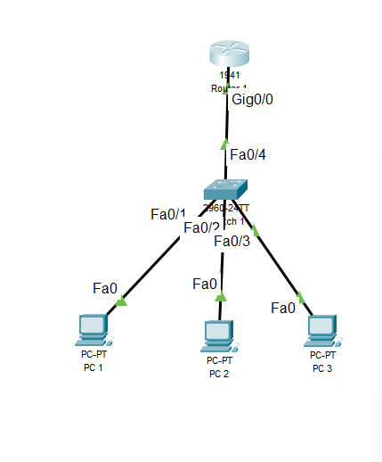

# Level 1 – Basic LAN Setup
### Cisco Packet Tracer Skills Gauntlet



## Project Overview
Built a small office LAN from scratch using Cisco Packet Tracer. Configured static IP addressing on three end devices, set up a Layer 2 switch, and configured a Cisco 1941 router interface. Verified end-to-end connectivity using ICMP ping tests.

---

## Network Topology

```
[PC1: 192.168.1.10] ──┐
[PC2: 192.168.1.20] ──┤── [Switch 2960] ── [Router 1941: 192.168.1.1]
[PC3: 192.168.1.30] ──┘
```

## Device Configuration

| Device | Model | Interface | IP Address | Subnet Mask | Default Gateway |
|--------|-------|-----------|------------|-------------|-----------------|
| PC1 | PC-PT | FastEthernet0 | 192.168.1.10 | 255.255.255.0 | 192.168.1.1 |
| PC2 | PC-PT | FastEthernet0 | 192.168.1.20 | 255.255.255.0 | 192.168.1.1 |
| PC3 | PC-PT | FastEthernet0 | 192.168.1.30 | 255.255.255.0 | 192.168.1.1 |
| Router 1 | Cisco 1941 | GigabitEthernet0/0 | 192.168.1.1 | 255.255.255.0 | — |
| Switch 1 | Cisco 2960 | — | — | — | — |

---

## Router Configuration

```cisco
enable
configure terminal
interface GigabitEthernet0/0
 ip address 192.168.1.1 255.255.255.0
 no shutdown
end
```

---

## Verification Commands Used

```cisco
show ip interface brief
```
Output confirmed GigabitEthernet0/0 status: **up/up**

```
ping 192.168.1.1   → 4/4 packets received (0% loss)
ping 192.168.1.20  → 4/4 packets received (0% loss)
ping 192.168.1.30  → 4/4 packets received (0% loss)
```

---

## Concepts Learned

**Static vs DHCP addressing**
Static IP means manually assigning an address that never changes. DHCP means a server automatically assigns addresses. Infrastructure devices like routers use static IPs so they are always reachable at a known address.

**FastEthernet vs RS232 vs USB ports**
FastEthernet is used for LAN data traffic between end devices and switches. RS232 (serial/console) is used for direct device management via terminal. USB is not used for LAN connectivity in standard network topologies.

**Router interfaces are administratively down by default**
Unlike switches, router interfaces must be explicitly turned on using the `no shutdown` command. Forgetting this is one of the most common misconfigurations in entry-level networking.

**`show ip interface brief`**
One of the most important verification commands in Cisco IOS. Displays all interfaces, their IP addresses, and up/down status at a glance. Used constantly in real network operations.

**OSI Troubleshooting Model (bottom-up)**
When a ping fails, always check in this order:
- Layer 1 (Physical) — are cables connected? Are links green?
- Layer 2 (Data Link) — are correct ports used? Has STP converged?
- Layer 3 (Network) — are IPs correct? Is the interface up/up?

**ARP (Address Resolution Protocol)**
Before a ping can send, the device must resolve the destination IP to a MAC address. ARP broadcasts "who has this IP?" and the target responds. This is why the first ping in a new network is sometimes slow or fails — ARP runs first.

**CLI Error Marker (`^`)**
When a Cisco IOS command is mistyped, the router places a `^` under the exact character where it got confused. Always read the line above the error message to understand what went wrong.

**STP (Spanning Tree Protocol)**
Switches run STP automatically to prevent loops. When a new link comes up, the port cycles through Blocking → Listening → Learning → Forwarding states before passing traffic. This takes 30–50 seconds by default.

---

## Screenshots

| File | Description |
|------|-------------|
| `level1-topology.png` | Full topology with all green links |
| `level1-router-config.png` | Router CLI configuration output |
| `level1-show-ip-brief.png` | Interface verification — Gig0/0 up/up |
| `level1-ping-success.png` | Successful ping from PC1 to all devices |

---

## Tools Used
- Cisco Packet Tracer 8.x
- Cisco IOS CLI
- Cisco 1941 Router

- ## Project File
Download the Packet Tracer file: [level1-basic-lan.pkt](level1-basic-lan.pkt)
- Cisco 2960 Switch

---

*Part of the Packet Tracer Skills Gauntlet — a progressive 5-level networking project series.*  
*Next: Level 2 — VLANs + Inter-VLAN Routing*
