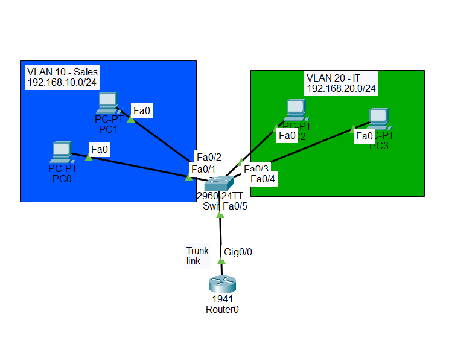

# Level 2 – VLANs + Inter-VLAN Routing
### Cisco Packet Tracer Skills Gauntlet



## Project Overview
Extended the basic LAN from Level 1 into a segmented network using VLANs. Configured a Cisco 2960 switch with two VLANs (Sales and IT), set up a trunk link to a Cisco 1941 router, and implemented router-on-a-stick to enable communication between the two isolated networks. Verified both intra-VLAN and inter-VLAN connectivity using ICMP ping tests.

---

## Network Topology

```
[PC0: 192.168.10.10] ──Fa0/1──┐
[PC1: 192.168.10.20] ──Fa0/2──┤
                               ├── [Switch 2960] ──Fa0/5 (trunk)──[Router 1941]
[PC2: 192.168.20.10] ──Fa0/3──┤                                    Gig0/0.10: 192.168.10.1
[PC3: 192.168.20.20] ──Fa0/4──┘                                    Gig0/0.20: 192.168.20.1
```

---

## VLAN Design

| VLAN | Name | Subnet | Ports |
|------|------|--------|-------|
| 10 | Sales | 192.168.10.0/24 | Fa0/1, Fa0/2 |
| 20 | IT | 192.168.20.0/24 | Fa0/3, Fa0/4 |

## Device Configuration

| Device | VLAN | IP Address | Subnet Mask | Default Gateway |
|--------|------|-----------|-------------|-----------------|
| PC0 | 10 | 192.168.10.10 | 255.255.255.0 | 192.168.10.1 |
| PC1 | 10 | 192.168.10.20 | 255.255.255.0 | 192.168.10.1 |
| PC2 | 20 | 192.168.20.10 | 255.255.255.0 | 192.168.20.1 |
| PC3 | 20 | 192.168.20.20 | 255.255.255.0 | 192.168.20.1 |
| Router Gig0/0.10 | 10 | 192.168.10.1 | 255.255.255.0 | — |
| Router Gig0/0.20 | 20 | 192.168.20.1 | 255.255.255.0 | — |

---

## Switch Configuration

```cisco
enable
configure terminal

vlan 10
 name Sales
vlan 20
 name IT

interface FastEthernet0/1
 switchport mode access
 switchport access vlan 10
interface FastEthernet0/2
 switchport mode access
 switchport access vlan 10
interface FastEthernet0/3
 switchport mode access
 switchport access vlan 20
interface FastEthernet0/4
 switchport mode access
 switchport access vlan 20

interface FastEthernet0/5
 switchport mode trunk
end
```

## Router Configuration (Router-on-a-Stick)

```cisco
enable
configure terminal

interface GigabitEthernet0/0
 no shutdown

interface GigabitEthernet0/0.10
 encapsulation dot1Q 10
 ip address 192.168.10.1 255.255.255.0

interface GigabitEthernet0/0.20
 encapsulation dot1Q 20
 ip address 192.168.20.1 255.255.255.0
end
```

---

## Verification Commands Used

```cisco
show vlan brief
```
Confirmed VLAN 10 (Sales) active on Fa0/1-2, VLAN 20 (IT) active on Fa0/3-4.

```cisco
show ip interface brief
```
Confirmed Gig0/0.10 and Gig0/0.20 both up/up.

**Ping results from PC0:**
```
ping 192.168.10.20  → 4/4 packets (0% loss)   — within VLAN 10
ping 192.168.20.10  → 3/4 packets (25% loss)  — across VLANs (1 lost to ARP)
ping 192.168.20.20  → 3/4 packets (25% loss)  — across VLANs (1 lost to ARP)
```
Note: 25% loss on first cross-VLAN ping is expected — the first packet triggers ARP resolution. Subsequent pings return 0% loss.

---

## Concepts Learned

**What is a VLAN?**
A VLAN (Virtual LAN) logically segments one physical switch into multiple isolated networks. Devices on VLAN 10 cannot communicate with devices on VLAN 20 at Layer 2 even though they share the same physical switch. This improves security and reduces broadcast traffic.

**Access ports vs trunk ports**
An access port belongs to exactly one VLAN and carries untagged traffic to end devices. A trunk port carries traffic for multiple VLANs simultaneously using 802.1Q tags so the receiving device knows which VLAN each frame belongs to.

**802.1Q tagging**
The IEEE standard for VLAN tagging on trunk links. When a frame enters a trunk port, the switch inserts a 4-byte tag into the Ethernet header identifying the VLAN. The receiving device reads the tag and forwards accordingly. End devices never see these tags.

**Router-on-a-stick**
A method of inter-VLAN routing using a single physical link between a switch and router. The switch port is set to trunk mode. The router creates logical subinterfaces (Gig0/0.10, Gig0/0.20) each mapped to a VLAN via `encapsulation dot1Q`. Traffic between VLANs travels up the trunk to the router and back down — the router acts as the gateway between networks.

**Subinterfaces**
Virtual interfaces created on top of a physical router interface. Each subinterface handles one VLAN and has its own IP address, acting as the default gateway for that VLAN's devices.

**Why the first cross-VLAN ping shows packet loss**
The first packet triggers ARP on a new subnet. ARP must resolve the MAC address of the default gateway before the ping can send. This takes one packet's worth of time, causing a single timeout. All subsequent pings succeed because the ARP entry is now cached.

**`show vlan brief`**
Verifies VLAN assignments on a switch. Shows VLAN ID, name, status, and assigned ports. Trunk ports do not appear here — they carry all VLANs and are verified separately with `show interfaces trunk`.

---

## Screenshots

| File | Description |
|------|-------------|
| `level2-topology.png` | Full topology with all green links |
| `level2-vlan-brief.png` | Switch VLAN verification output |
| `level2-router-subif-config.png` | Router subinterface configuration |
| `level2-ping-same-vlan.png` | Successful ping within VLAN 10 |
| `level2-ping-across-vlan1.png` | Successful inter-VLAN ping to 192.168.20.10 |
| `level2-ping-across-vlan2.png` | Successful inter-VLAN ping to 192.168.20.20 |

---

## Tools Used
- Cisco Packet Tracer 8.x
- Cisco IOS CLI
- Cisco 1941 Router
- Cisco 2960 Switch

## Project File
Download the Packet Tracer file: [level2-vlan-intervlan.pkt](level2-vlan-intervlan.pkt)

---

*Part of the Packet Tracer Skills Gauntlet — a progressive 5-level networking project series.*
*Previous: Level 1 — Basic LAN Setup*
*Next: Level 3 — OSPF Dynamic Routing*
